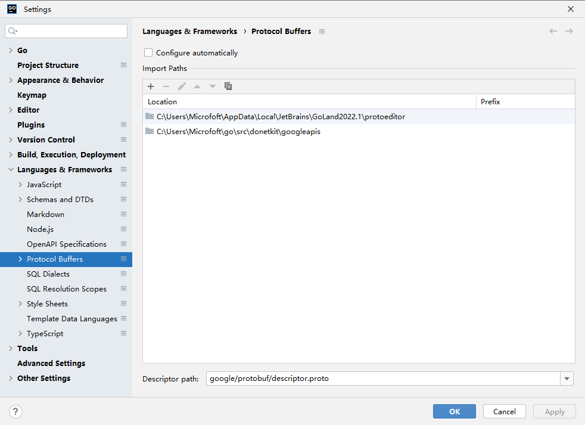

### protoc
protoc -I ./ -I C:/Users/Microfoft/AppData/Local/JetBrains/GoLand2022.1/protoeditor -I C:/Users/Microfoft/go/src/googleapis --go_out=. proto/hello/hello_world.proto


### googleapis

```
file://C:/Users/Microfoft/go/src/googleapis
OR
file://C:/Users/Microfoft/go/src/donetkit/googleapis
```


